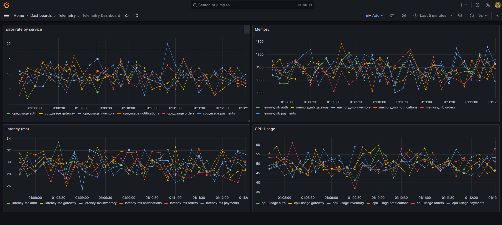

# Real-Time Telemetry Engine


A data pipeline that ingests service metrics in real time, processes them through Kafka, stores them in InfluxDB, and visualises everything live on a Grafana dashboard.

Built from scratch as a learning project — every line written by hand, every concept understood before writing it.

---

## Dashboard



<!-- ## Demo

[▶ Watch the live demo](https://youtube.com/link) -->

---

## What it does

Imagine you're running six backend services in production. Each one is constantly handling requests, consuming CPU, throwing the occasional error. You want to know — in real time — when something starts going wrong.

This engine does exactly that. Services send a small JSON payload to an HTTP endpoint. That payload gets validated, published to a Kafka topic, consumed by a background worker, written to a time-series database, and visualised on a live dashboard. The whole journey takes under a second.

If CPU on the payments service spikes, you see it immediately. If latency on auth starts climbing, it shows up on the chart before anyone notices in production.

During development, a mock generator fires 50 randomised payloads per second so there's always data flowing — no need to wire up real services to see it work.

---

## Stack

| Layer | Tool | Why |
|---|---|---|
| Ingestion API | Express.js | Simple, fast, well understood |
| Message broker | Apache Kafka | Handles massive throughput, decouples services |
| Stream processing | Node.js worker | Consumes from Kafka, writes to InfluxDB |
| Time-series DB | InfluxDB 2.x | Purpose-built for metrics, fast range queries |
| Dashboards | Grafana | Best-in-class for this kind of data |
| Infrastructure | Docker Compose | One command to start everything |

---

## How data flows

```
Mock generator (or real services)
        │
        ▼
POST /ingest              ← validates payload, checks API key
        │
        ▼
Kafka topic               ← telemetry.raw buffers everything
        │
        ▼
Stream processor          ← consumes messages, writes to DB
        │
        ├──▶ InfluxDB     ← stores the time-series data
        │
        └──▶ Alert logs   ← logs warnings on threshold breaches
                │
                ▼
            Grafana        ← reads from InfluxDB, draws live charts
```

---

## Project structure

```
telemetry-engine/
├── docker-compose.yml          ← Kafka, InfluxDB, Grafana — one file
├── .env                        ← all config in one place (gitignored)
├── package.json                ← monorepo root
│
├── packages/
│   ├── api/                    ← HTTP ingestion service
│   │   └── src/
│   │       ├── index.js              Express server entry point
│   │       ├── middleware/auth.js    API key validation
│   │       ├── schema/telemetry.js   Zod payload schema
│   │       └── kafka/producer.js     publishes to Kafka
│   │
│   ├── processor/              ← background worker
│   │   └── src/
│   │       ├── index.js              worker entry point
│   │       ├── kafka/consumer.js     subscribes to Kafka topic
│   │       └── influx/writer.js      writes data points to InfluxDB
│   │
│   └── generator/              ← mock data for development
│       └── src/
│           └── index.js              fires randomised payloads at the API
│
└── grafana/
    └── provisioning/           ← auto-configures datasource and dashboard on boot
        ├── datasources/
        │   └── influxdb.yml
        └── dashboards/
            ├── dashboard.yml
            └── telemetry.json
```

Three independent Node processes. Each can be restarted without touching the others. All config flows from a single `.env` file.

---

## Getting started

You need Docker Desktop and Node.js 18+ installed.

**1. Start the infrastructure**

```bash
docker-compose up -d
```

Starts Kafka, Zookeeper, InfluxDB, and Grafana. Give it 30 seconds then check:

```bash
docker-compose ps
```

All four should show `Up`.

**2. Install dependencies**

```bash
npm install
```

This installs dependencies for all three packages at once — the root `package.json` uses npm workspaces to manage `packages/api`, `packages/processor`, and `packages/generator` together. No need to `cd` into each one.

**3. Configure `.env`**

Create a `.env` file at the root and fill in the values — use `.env.example` as a template. The defaults work out of the box for local development.

**4. Start the services**

Run all three together:

```bash
npm run dev
```

Or start them individually in separate terminals:

```bash
npm run api          # ingestion API on port 3000
npm run processor    # background worker
npm run generator    # mock data — 50 req/s
```

These scripts are defined in the root `package.json` — no need to navigate into individual package folders.

**5. Open Grafana**

Go to [http://localhost:3001](http://localhost:3001) and log in with `admin / admin`.

The InfluxDB datasource and dashboard are provisioned automatically — no manual setup needed.

---

## Sending data manually

Once the API is running, test it with a single payload:

```bash
curl -X POST http://localhost:3000/ingest \
  -H "Content-Type: application/json" \
  -H "x-api-key: dev-secret-key" \
  -d '{
    "timestamp": "2026-01-01T00:00:00Z",
    "service": "payments",
    "region": "us-east-1",
    "cpu_usage": 45.2,
    "memory_mb": 512,
    "latency_ms": 134,
    "status_code": 200,
    "error": false,
    "request_id": "test-001"
  }'
```

`202` means it's in Kafka. `400` means the payload failed validation — the response body tells you exactly what's wrong.

---

## Configuration

| Variable | Default | What it does |
|---|---|---|
| `API_PORT` | `3000` | Express server port |
| `API_KEY` | `dev-secret-key` | Required header on every `/ingest` request |
| `KAFKA_BROKERS` | `localhost:9092` | Kafka broker address |
| `KAFKA_TOPIC` | `telemetry.raw` | Topic the API publishes to |
| `KAFKA_GROUP_ID` | `telemetry-processor` | Consumer group for the processor |
| `INFLUX_URL` | `http://localhost:8086` | InfluxDB address |
| `INFLUX_TOKEN` | — | InfluxDB auth token |
| `INFLUX_ORG` | `telemetry-org` | InfluxDB organisation |
| `INFLUX_BUCKET` | `telemetry` | InfluxDB bucket |
| `TARGET_URL` | `http://localhost:3000` | Generator target |
| `RATE` | `50` | Generator requests per second |

---

## Alerting

The processor evaluates every raw event against these rules and logs when one triggers:

| Rule | Condition | Severity |
|---|---|---|
| High CPU | `cpu_usage > 90` | critical |
| High latency | `latency_ms > 1000` | warning |
| Server error | `status_code > 499` | critical |

The mock generator intentionally spikes CPU ~8% of the time so you'll see alerts within seconds of starting.

---

## Load testing

Crank the generator and watch the dashboard react:

```bash
RATE=1000 node packages/generator/src/index.js
```

Check Kafka consumer lag to see if the processor is keeping up:

```bash
docker exec -it telemetry-engine-kafka-1 kafka-consumer-groups \
  --bootstrap-server localhost:9092 \
  --describe --group telemetry-processor
```

If the lag keeps growing, the processor is falling behind — batch your InfluxDB writes to fix it.

---

## Service URLs

| Service | URL | Credentials |
|---|---|---|
| Ingestion API | http://localhost:3000 | `x-api-key` header |
| InfluxDB UI | http://localhost:8086 | admin / adminpassword |
| Grafana | http://localhost:3001 | admin / admin |

---

## Stopping

```bash
docker-compose down        # stop containers, keep data
docker-compose down -v     # stop containers, wipe everything
```

---

## What I learned building this

I started this project knowing Node.js and basic Docker but having never touched Kafka or InfluxDB. A few things that surprised me along the way:

**Kafka is simpler than it looks.** The terminology — brokers, topics, consumer groups, offsets — sounds intimidating, but the core idea is just a very durable queue. Once that clicked, everything else followed.

**Separation of concerns actually matters.** Running the API, processor, and generator as three separate processes felt like overkill at first. Then the processor crashed mid-run and the API kept accepting requests without losing a single message. Kafka held everything in the queue until the processor came back up. That was the moment it made sense.

**Docker Compose is underrated.** Four production-grade services — Kafka, Zookeeper, InfluxDB, Grafana — running locally in under a minute with one command. I won't go back to manual installs.

**async/await hides a lot of complexity.** Understanding the event loop and how callbacks, promises, and async/await relate to each other made me much more confident about what my code was actually doing — not just that it worked.

**Time-series data is different.** In a relational database you'd normalise this across multiple tables. In InfluxDB you denormalise everything into tags and fields on a single measurement. It felt wrong at first, then I saw how fast the queries were.

If I were doing this again, I'd add proper error handling and retry logic from day one instead of bolting it on at the end.